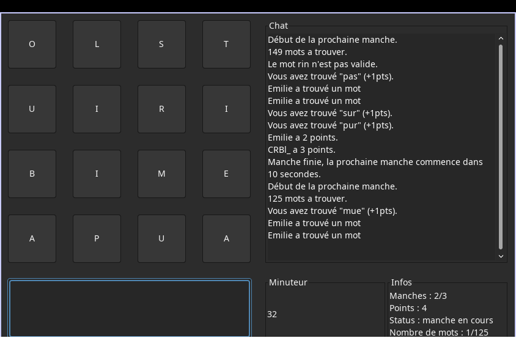

---
title:
- Ouga Boggle - Un jeu boggle open source en ligne
author:
- Claire Chenillet
- Bogdan Crisan
- Florian Gaie
- Philippe Hinault
- Emilie Lin
theme:
- Copenhagen
date:
- 16 avril 2022
---

# Comment on joue ?

## Lancement

- Lancer un serveur
- Lancer un client
- Connexion des clients

## Lobby

- Paramétrage de la partie
- Attente que les joueurs soient prêts

## Partie

- Trouver les mots
- Pause
- Fin

# Fonctionnalités

## Cahier des charges

Les fonctionnalités qui sont incluses dans le cahier des charges.

## Extensions

Les fonctionnalités que nous avons décidées de rajouter en plus de celles du cahier des charges.

# Interface

## Entrée des mots

- Clavier
- Souris

## Chat

- Mots vérifiés
- Mot trouvés par les autres
- Informations de la partie

## Panneau d'informations

- Minuteur
- Nombre total de mots
- Nombre de manches
- Points
- Status

# Interface



# Algorithmes

## Dictionnaire

Vérifier si les mots que les joueurs tapent existent dans le dictionnaire

## Trouver les mots dans la grille

- Clavier
- Souris

## Générer une grille

Gérer la fréquence des lettres afin qu'il y ait le plus de mots à faire.

# Dictionnaire

- Indexer avec un arbre
- Libraire java

# Indexer avec un arbre

{ height=200px }

# Libraire java

```java
Set<String> mots;

boolean estUnMot(String mot) {
    return mots.contains(mot);
}
```

# Trouver les mots dans la grille

## Clavier

Trouver si le mot peut être trouvé dans la grille.

## Souris

Vérifier si les coordonnés sont adjacentes et s'il n'y a pas de doublons.

# Générer une grille

## Initialement

- Langues
- Fréquence des lettres

## Version améliorée

- Fréquence des lettres extraite des fichiers de dictionnaire
- L'utilisateur peut donner son propre fichier de dictionnaire

# Minuteur

- Gère le lancement des manches
- Gère la pause

# Historique

- Sauvegarde de l'historique
- Visualisation

# Extensions

- Multijoueur
- Ligne de commande
- Paramétrages libres
- Sauvegarde
- Chat
- Modes de jeu
- Trouver tous les mots de la grille
- Documentation
- Lobby

# Communication serveur / client : connexion

{ height=200px }

# Communication serveur / client : vérification des mots


# Ligne de commande

```bash
$ ouga-boggle -w mdp123 serveur &
$ ouga-boggle -w mdp123 client -P flo
```

```bash
$ ouga-boggle -w mdp123 client -P emi -h 54.156.21.63
```

```bash
$ ouga-boggle --gui serveur &
$ ouga-boggle --gui client
```

# Paramétrage libre

- Taille dynamique
- Plusieurs langues
- Modes de jeux
- Nombre de manches
- Durée d'une manche

# Paramétrage libre


# Sauvegarde

- Déclenchement d'une pause par vote (`/pause`)
- Fichier de sauvegarde généré
- Sélection du fichier
- La partie reprend

# Chat

- Envoi de messages entre les joueurs
- Informations relatives à la partie
    - Début de partie
    - Fin de partie
    - Début de manche
    - Fin de manche
- Informations relatives aux autres joueurs
    - Mot trouvé
    - Connexion/déconnexion
- Retour sur les mots trouvés

# Chat


# Trouver tous les mots dans la grille


# Documentation


# Lobby

{ height=200px }

# Lobby


# Utilisation GitLab

- CI/CD
- Tests
- Formatage
